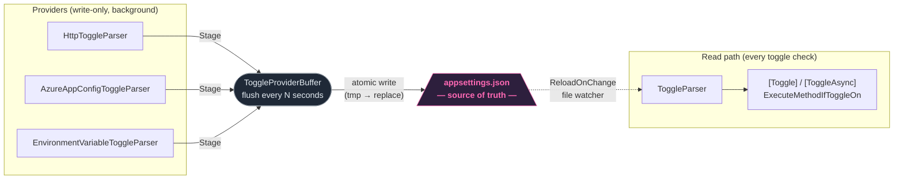

[](https://www.nuget.org/packages/FtrIO)
[](https://TheScottBot.github.io/FtrIO/)

# FtrIO

FtrIO == Feature I/O

Gate method execution from config — no `if` statements, no wrapper classes. Decorate a method with `[Toggle]` and it becomes automatically gated by its own name.

## Installation

```bash
dotnet add package FtrIO
```

## Why FtrIO?

- **Zero call-site noise.** `[Toggle]` is woven directly into the method's IL by AspectInjector at compile time. A toggled method looks and calls exactly like a normal method — no `if (featureFlags.IsEnabled(...))`, no injected service, no wrapper at every call site. Remove the attribute and the method is back to normal.
- **appsettings.json as a read-through cache.** Other libraries make your app depend on an external flag service being online. FtrIO flips this: providers run in the background and write their state into `appsettings.json`; `ToggleParser` always reads from the file. If the remote source goes offline, the last known state is served automatically from disk — no fallback code, no circuit breaker, no stale-cache TTL to configure.
- **Escape hatch built in.** The same `appsettings.json` you already deploy works as a fully functional toggle store without any provider. Swap from a static file to Azure App Config (or back) without touching a single call site.

## The FtrIO ecosystem

- **[FtrIO](https://github.com/TheScottBot/FtrIO)** — the core library. Weaves `[Toggle]` into your IL at compile time, reads state from `appsettings.json` at runtime, and optionally syncs from remote sources via the provider pipeline.
- **[FtrIO.Toaster](https://github.com/TheScottBot/FtrIO.Toaster)** — a lightweight web UI for managing toggles live. Writes values through `ToggleProviderBuffer` so changes flush to `appsettings.json` and are picked up instantly via `ReloadOnChange` — no file editing, no restart.
- **[ftrio-onetwo](https://github.com/TheScottBot/ftrio-onetwo)** — a .NET CLI audit tool. Scans your source tree for every toggle reference, cross-references against `appsettings.json`, and reports each toggle's state (ON / OFF / 20% / BLUE / MISSING) with file and line number.

```
┌─────────────────────────────────────────────────────┐
│  Your code                                          │
│  [Toggle] public void SendWelcomeEmail() { ... }    │
└───────────────────┬─────────────────────────────────┘
                    │ compile-time weaving
                    ▼
┌─────────────────────────────────────────────────────┐
│  FtrIO core                                         │
│  gates method execution at runtime                  │
└───────────────────┬─────────────────────────────────┘
                    │ reads
                    ▼
┌─────────────────────────────────────────────────────┐
│  appsettings.json  — source of truth                │
└──────────┬──────────────────────────┬───────────────┘
           │ writes live              │ reads & audits
           ▼                          ▼
  FtrIO.Toaster                 ftrio-onetwo
  (web UI — manage toggles)     (CLI — audit state)
```

## How it compares

|  | **FtrIO** | LaunchDarkly | Microsoft.FeatureManagement | Flagsmith |
|--|-----------|-------------|----------------------------|-----------|
| **Call-site syntax** | `[Toggle]` attribute, zero noise | SDK call at every site | `if (await _fm.IsEnabledAsync(...))` | SDK call at every site |
| **Works offline** | ✅ always (file-backed) | ❌ needs SDK fallback config | ✅ | ❌ needs SDK fallback config |
| **Compile-time validation** | ✅ Roslyn analyzer | ❌ | ❌ | ❌ |
| **Percentage rollout** | ✅ | ✅ | ✅ | ✅ |
| **Self-hosted / no vendor** | ✅ | ❌ paid SaaS | ✅ | ✅ (or SaaS) |
| **Cost** | Free, OSS | Paid SaaS | Free, OSS | Free tier / paid SaaS |

---

## Quick start

Add a `Toggles` section to `appsettings.json` and decorate methods — that's it.

```json
{
  "FtrIO": { "ReloadOnChange": true },
  "Toggles": {
    "SendWelcomeEmail": true,
    "NewCheckoutFlow": false
  }
}
```

```csharp
using FtrIO;

[Toggle]
public void SendWelcomeEmail() { ... }

SendWelcomeEmail(); // runs only if "SendWelcomeEmail": true
```

Any project that decorates its own methods needs an [AspectInjector](https://github.com/pamidur/aspect-injector) reference — weaving is per-compilation:

```xml
<PackageReference Include="AspectInjector" Version="2.9.0" />
```

> **[Full docs →](https://TheScottBot.github.io/FtrIO/)** — async, hot-reload, exceptions, analyzer, DI, deploying appsettings.json

---

## Dynamic providers

Providers let toggle state be driven by external sources at runtime while `appsettings.json` remains the single source of truth for all reads.



Providers push updates into `ToggleProviderBuffer`; the buffer flushes to `appsettings.json` on a configurable interval; `ToggleParser` reads from the file as normal. If a provider goes offline, the last flushed state persists automatically. `[Toggle]`, `[ToggleAsync]`, and `ExecuteMethodIfToggleOn` call sites are completely unchanged.

```bash
dotnet add package FtrIO.Providers.Http
dotnet add package FtrIO.Providers.AzureAppConfig
```

> **`ReloadOnChange: true` is mandatory when using providers** — without it `ToggleParser` reads the file once at startup and never sees buffer flushes.

> **[Provider docs →](https://TheScottBot.github.io/FtrIO/#providers)**

---

## Strategy-based decisions

`StrategyToggleParser` routes raw config values through a chain of `IToggleDecisionStrategy` implementations — percentage rollouts, blue-green slots, or any custom logic — with `BooleanStrategy` always appended as the final fallback.

```csharp
ToggleParserProvider.Configure(new StrategyToggleParser(
    new PercentageRolloutStrategy(),
    new BlueGreenStrategy("blue", "blue", "green")
));
```

```json
{ "Toggles": { "NewCheckout": "20%", "PaymentV2": "blue" } }
```

> **[Strategy docs →](https://TheScottBot.github.io/FtrIO/#strategies)**

---

## Reference

| Topic | Link |
|-------|------|
| Async — `[ToggleAsync]`, `ExecuteMethodIfToggleOnAsync` | [docs/#async](https://TheScottBot.github.io/FtrIO/#async) |
| Hot-reload — `ReloadOnChange` | [docs/#hotreload](https://TheScottBot.github.io/FtrIO/#hotreload) |
| Manual control — `ExecuteMethodIfToggleOn` | [docs](https://TheScottBot.github.io/FtrIO/) |
| Custom parser / Dependency Injection | [docs/#di](https://TheScottBot.github.io/FtrIO/#di) |
| Exceptions — `ToggleDoesNotExistException` etc. | [docs/#exceptions](https://TheScottBot.github.io/FtrIO/#exceptions) |
| Compile-time validation — `FTRIO001` | [docs/#analyzer](https://TheScottBot.github.io/FtrIO/#analyzer) |
| Companion tooling — ftrio-onetwo | [github.com/TheScottBot/ftrio-onetwo](https://github.com/TheScottBot/ftrio-onetwo) |
| Companion UI — FtrIO.Toaster | [github.com/TheScottBot/FtrIO.Toaster](https://github.com/TheScottBot/FtrIO.Toaster) — lightweight web app to manage toggles directly via the buffer |
